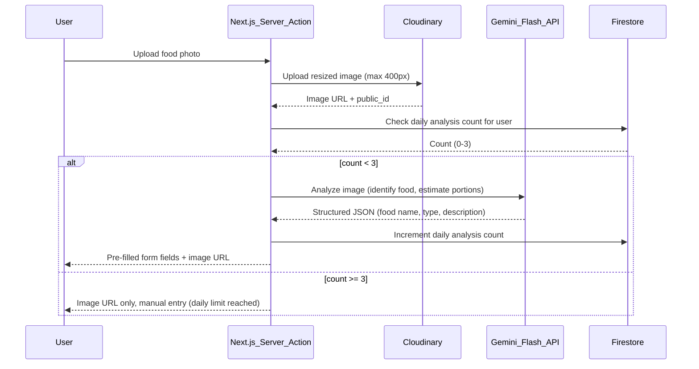

# Architecture: Food Diary Web Application

## 1. Monorepo Architecture

### 1.1. Monorepo Structure

The project uses Turborepo with pnpm workspaces to manage multiple applications and shared packages:

```
try-react/
├── apps/
│   └── food-diary/          # Next.js 15 application
│       ├── src/
│       ├── messages/        # i18n translation files (en.json, nl.json)
│       ├── package.json
│       └── next.config.ts
├── packages/
│   └── ui/                  # Shared component library
│       ├── src/
│       │   └── components/ # React Aria + Tailwind components
│       ├── package.json
│       └── tsconfig.json
├── turbo.json               # Turborepo configuration
├── pnpm-workspace.yaml      # pnpm workspace configuration
├── package.json             # Root package.json
└── docs/
    └── stories/             # User stories
```

### 1.2. Package Management

- **pnpm workspaces:** Used for managing dependencies across packages
- **Turborepo:** Handles build orchestration, caching, and task running
- **Shared UI Package:** Exported as `@repo/ui` for use across applications

## 2. Frontend Architecture (React 19 with Next.js App Router)

### 2.1. Technology Stack

- **React 19:** JavaScript library for building user interfaces with Server Actions support
- **Next.js 15/16:** App Router for routing, Server Components, and Server Actions
- **TypeScript:** Strict mode for type safety
- **Tailwind CSS 4:** Utility-first CSS framework with `@theme` design tokens
- **next-intl:** Internationalization library for Next.js App Router
- **React Aria:** Accessible component primitives from Adobe
- **Client-side State Management:** React's built-in `useState`, `useReducer`, and `useContext` for component-level and application-level state

### 2.2. Component Structure

#### Shared UI Package (`packages/ui`)

- **Location:** `packages/ui/src/components/`
- **Structure:** Each component follows the project rules pattern:
  ```
  ComponentName/
  ├── ComponentName.tsx    # Component implementation
  ├── ComponentName.test.tsx  # Jest unit tests
  ├── ComponentName.stories.tsx  # Storybook stories
  └── index.ts             # Types + exports
  ```
- **Components:** Built using React Aria primitives with Tailwind styling:
  - `Button` - Accessible button component
  - `TextField` - Text input with label and error states
  - `Select` - Dropdown select component
  - `TagGroup` - Multi-select chips/tags for emotions and behaviors
  - `Switch` - Toggle switch for skipped meal
  - `DatePicker` - Date selection component
  - `Dialog` - Modal dialogs
  - `ImageUpload` - Image upload component with preview

#### Application Components (`apps/food-diary/src/components/`)

- `EntryForm.tsx`: Component for creating and editing food diary entries using shared UI components
- `EntryCard.tsx`: Component to display a single diary entry in the overview screen
- `EntryOverview.tsx`: Component to display all diary entries, grouped by day, using `EntryCard` components
- `AuthButtons.tsx`: Component for Google and Facebook login buttons, and guest login option
- `LanguageSwitcher.tsx`: Component to switch between Dutch and English
- `ImageUploader.tsx`: Component for uploading food photos with preview and AI analysis trigger

#### Application Routes (`apps/food-diary/src/app/`)

- `page.tsx`: Main page component housing the `EntryOverview` component
- `entry/create/page.tsx`: Page for creating a new diary entry, containing the `EntryForm` component
- `auth/login/page.tsx`: Page for login options (`AuthButtons`)
- `[locale]/layout.tsx`: Locale-aware layout wrapper for next-intl

### 2.3. Internationalization (i18n)

- **Library:** next-intl
- **Locales:** Dutch (nl) - default, English (en)
- **Translation Files:** `apps/food-diary/messages/en.json` and `nl.json`
- **Middleware:** Locale detection and routing via Next.js middleware
- **Usage:** All user-facing strings extracted to JSON files, no hardcoded text in components

### 2.4. Server Actions for Backend Interaction

Server Actions are defined in `apps/food-diary/src/app/actions.ts` or within components:

- `saveDiaryEntry(formData)`: Saves new diary entries to Firestore, including image URLs
- `fetchDiaryEntries(userId)`: Fetches diary entries from Firestore for the overview screen
- `uploadImageToCloudinary(file)`: Uploads resized image to Cloudinary, returns URL and public_id
- `analyzeFoodImage(imageUrl)`: Calls Gemini Flash API to analyze food image, enforces 3/day limit
- `checkAnalysisQuota(userId)`: Checks daily analysis count for user
- `incrementAnalysisQuota(userId)`: Increments daily analysis count after successful analysis

## 3. Backend Architecture (Firebase + Cloudinary + Gemini)

### 3.1. Firebase Services

#### Firebase Authentication

  - Used for user authentication:
    - Google Login
    - Facebook Login
  - Guest Authentication (anonymous auth)
- Client-side implementation using Firebase SDK

#### Google Firestore

NoSQL document database for storing application data.

**Collections:**

1. **Users Collection:**
      ```
      /users/{userId}
      ```
   - `userId` (String): Firebase Authentication UID

2. **Diary Entries Collection:**
      ```
      /diaryEntries/{entryId}
      ```
   - `userId` (String): User ID (Firebase UID or Guest User ID)
   - `entryType` (String): "breakfast", "lunch", "dinner", "snack", "moment", "thought"
   - `foodEaten` (String)
   - `emotions` (Array of Strings): Selected emoticons
   - `location` (String): "home", "work", "restaurant", "friend's house", "on the road", "family event"
   - `company` (String): "family", "friends", "alone", "colleagues", "kids", "partner"
   - `description` (String)
   - `behavior` (Array of Strings): Selected behaviors
   - `skippedMeal` (Boolean)
   - `date` (Timestamp): Firestore Timestamp for date
   - `time` (String): "HH:mm"
   - `imageUrl` (String, optional): Cloudinary URL of food photo
   - `imagePublicId` (String, optional): Cloudinary public_id for image management
   - `createdAt` (Timestamp): Firestore Timestamp (auto-generated)
   - `updatedAt` (Timestamp): Firestore Timestamp (auto-updated)

3. **User Analysis Quota Collection:**
   ```
   /userAnalysisQuota/{userId}
   ```
   - `date` (String): "YYYY-MM-DD" format
   - `count` (Number): 0-3, number of AI analyses used today
   - `lastReset` (Timestamp): Last time quota was reset (for daily reset logic)

### 3.2. Cloudinary Integration

- **Purpose:** Store resized food images (max 400px width/height)
- **Free Tier Limits:** 25GB storage, 25GB bandwidth/month
- **Image Processing:** Client-side resize before upload to stay within limits
- **Storage:** Images stored with user-specific folder structure for organization
- **Response:** Returns `imageUrl` and `public_id` for Firestore storage

### 3.3. Google Gemini Flash API Integration

- **Purpose:** AI-powered food image analysis
- **Model:** Gemini Flash (multimodal)
- **Free Tier:** 15 requests per minute, 1M tokens per day
- **Rate Limiting:** 3 analyses per user per day (enforced server-side)
- **Analysis Output:** Structured JSON containing:
  - `foodName` (String): Identified food items
  - `mealType` (String): Suggested meal type (breakfast, lunch, dinner, snack)
  - `description` (String): AI-generated description
  - `estimatedPortion` (String, optional): Portion size estimate
- **Flow:**
  1. User uploads image → Cloudinary
  2. Server Action checks daily quota in Firestore
  3. If quota < 3, call Gemini API with image URL
  4. Parse response and pre-fill form fields
  5. Increment quota counter in Firestore
  6. If quota >= 3, return image URL only (no analysis)

### 3.4. API Endpoints (Server Actions)

Server Actions in React components act as API endpoints:

- `saveDiaryEntry(formData)` - Saves entry to Firestore
- `fetchDiaryEntries(userId)` - Fetches entries for overview
- `uploadImageToCloudinary(file)` - Uploads image, returns URL
- `analyzeFoodImage(imageUrl, userId)` - Analyzes image via Gemini, enforces quota
- `checkAnalysisQuota(userId)` - Checks current daily quota
- `mergeGuestEntries(guestId, userId)` - Merges guest entries on account creation

## 4. Image Upload + AI Analysis Flow



## 5. Deployment Architecture (Vercel)

### 5.1. Vercel Platform

- Application deployed on Vercel, optimized for Next.js applications
- Vercel provides:
  - Serverless functions (for Server Actions)
  - Automatic deployments from Git repository
  - Global CDN for fast content delivery
  - Monorepo support via Turborepo integration

### 5.2. Configuration

#### Environment Variables

Set in Vercel project settings:

**Firebase:**
- `NEXT_PUBLIC_FIREBASE_API_KEY`
- `NEXT_PUBLIC_FIREBASE_AUTH_DOMAIN`
- `NEXT_PUBLIC_FIREBASE_PROJECT_ID`
- `NEXT_PUBLIC_FIREBASE_STORAGE_BUCKET`
- `NEXT_PUBLIC_FIREBASE_MESSAGING_SENDER_ID`
- `NEXT_PUBLIC_FIREBASE_APP_ID`

**Cloudinary:**
- `NEXT_PUBLIC_CLOUDINARY_CLOUD_NAME`
- `CLOUDINARY_API_KEY`
- `CLOUDINARY_API_SECRET`

**Google Gemini:**
- `GEMINI_API_KEY`

**next-intl:**
- `NEXT_PUBLIC_DEFAULT_LOCALE` (default: "nl")

#### Deployment Process

1. Connect Vercel project to Git repository (GitHub/GitLab/Bitbucket)
2. Configure Turborepo build settings in Vercel dashboard
3. Set environment variables in Vercel project settings
4. Vercel automatically builds and deploys on code push to main branch
5. Monorepo builds handled by Turborepo, caching optimized builds

### 5.3. Guest User ID Generation and Management

- For guest users, Firebase Anonymous Authentication generates a unique UID
- Guest UID stored in Firebase Auth and used as `userId` in Firestore `diaryEntries` collection
- Upon user registration (Google/Facebook login), guest entries are merged with the user's account:
  - Server Action `mergeGuestEntries(guestId, userId)` updates all guest entries with new authenticated userId
  - Guest account can be deleted or kept for reference

## 6. Design System & Styling

### 6.1. Tailwind CSS 4

- **Configuration:** CSS-first via `@theme` directive in `globals.css`
- **Design Tokens:** Colors, spacing, typography defined as CSS variables
- **No Config File:** No `tailwind.config.ts` - all customization in CSS
- **Mobile-First:** Responsive design using Tailwind breakpoints

### 6.2. Shared UI Components

- Built with React Aria for accessibility (keyboard navigation, ARIA attributes, screen reader support)
- Styled with Tailwind utilities following design tokens
- Each component follows project rules:
  - Types defined in `index.ts`
  - Props extend `React.ComponentProps<Element>`
  - Server Components by default (client components only when needed)
  - Comprehensive Jest and Storybook tests

This architecture document provides a high-level overview of the technical structure of the Food Diary Web Application. Further details will be elaborated in the user stories and implementation phases.
